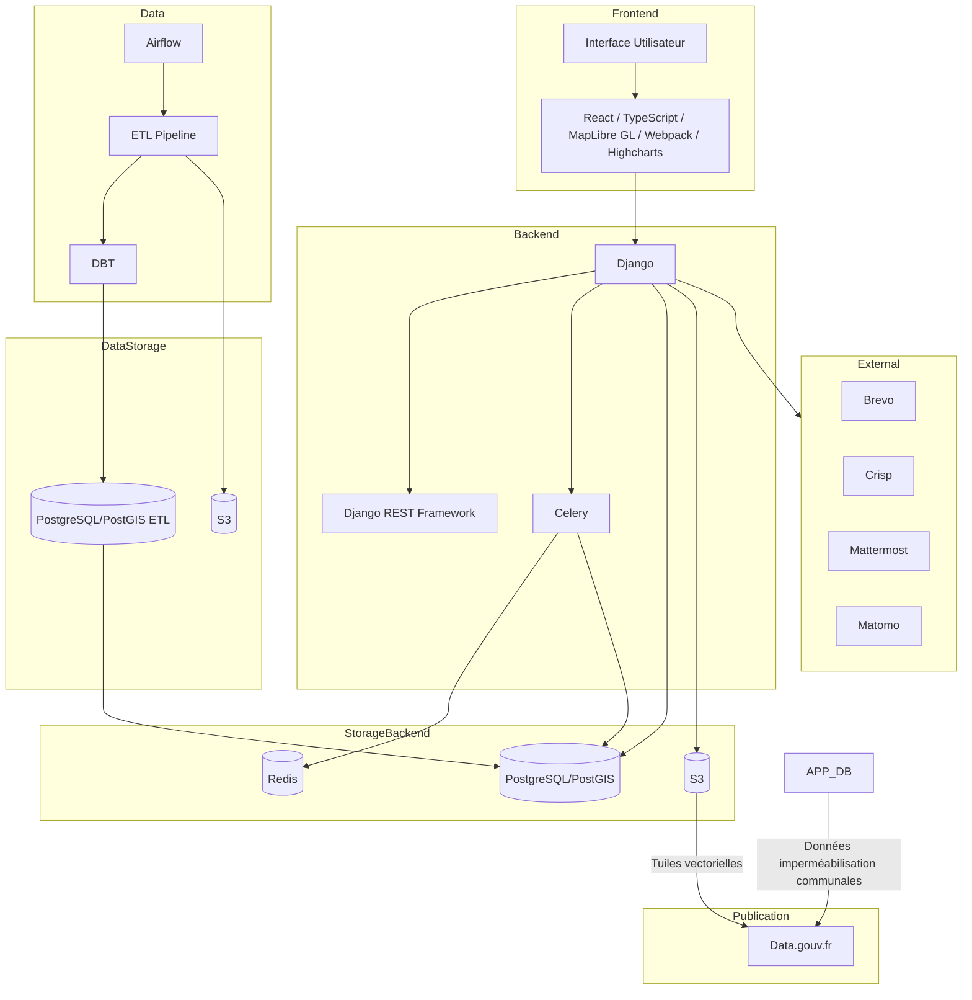
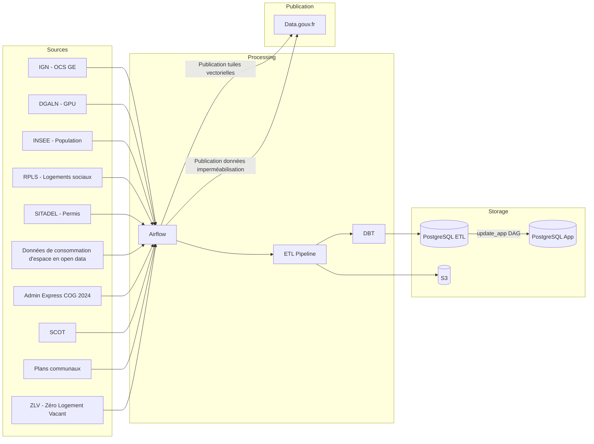
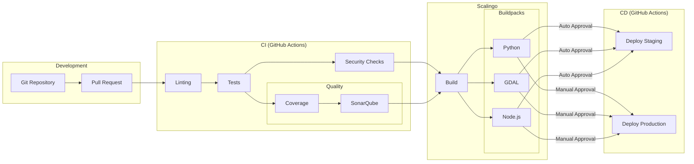

# Document d'architecture technique

## Architecture globale

### Vue d'ensemble

### Stack technique
- **Backend**: Django (Python)
- **Frontend**: TypeScript/JavaScript avec Webpack
- **Base de données**: PostgreSQL avec extension PostGIS
- **Cache et files d'attente**: Redis + Celery
- **Stockage objet**: AWS S3 compatible (Scaleway)
- **Conteneurisation**: Docker
- **CI/CD**: GitHub Actions

### Services externes
- Sendinblue pour l'envoi d'emails
- Crisp pour le chat support
- Mattermost pour les notifications internes
- Matomo pour l'analytique (optionnel)
- Highcharts pour la génération de graphiques

## Architecture Backend

### Structure du projet Django
Le projet est organisé en plusieurs applications Django :
- `project/`: Application principale
- `users/`: Gestion des utilisateurs
- `diagnostic_word/`: Génération de diagnostics
- `home/`: Pages d'accueil et statiques
- `utils/`: Utilitaires partagés

### Composants clés
1. **API REST**
   - Utilisation de Django REST framework
   - Points d'entrée définis dans `project/api_views.py`
   - Sérialisation via `project/serializers.py`

2. **Tâches asynchrones**
   - Celery pour le traitement asynchrone
   - Redis comme broker de messages
   - Tâches définies dans `project/tasks/`

3. **Modèles de données**
   - Modèles géospatiaux avec PostGIS
   - Organisation dans `project/models/`

4. **Système de templates**
   - Templates Django dans `project/templates/`
   - Tags personnalisés dans `project/templatetags/`

## Architecture des données

### Pipelines de données (Airflow)

1. **Données OCS GE (Occupation des Sols à Grande Échelle)**
   - `ocsge.py`: Pipeline principal de traitement OCS GE
   - `download_all_ocsge.py`: Téléchargement des données OCS GE
   - `identify_changed_ocsge_data.py`: Détection des changements
   - `create_ocsge_vector_tiles.py`: Génération des tuiles vectorielles
   - `diff_ocsge_download_page_to_mattermost.py`: Notifications des mises à jour

2. **Données administratives et territoriales**
   - `ingest_admin_express.py`: Import des données Admin Express
   - `ingest_gpu.py`: Import des documents d'urbanisme (GPU)
   - `ingest_plan_communal.py`: Import des plans communaux
   - `create_national_data_geopackage.py`: Création du geopackage national

3. **Données socio-économiques**
   - `ingest_population.py`: Données démographiques
   - `ingest_rpls.py`: Logements sociaux (RPLS)
   - `ingest_sitadel.py`: Permis de construire
   - `ingest_majic.py`: Données foncières (MAJIC)
   - `ingest_scots.py`: Schémas de cohérence territoriale
   - `ingest_zlv.py`: Zones de logements vacants

4. **Maintenance et mise à jour**
   - `update_app.py`: Mise à jour des données applicatives
   - `update_vector_tiles.py`: Mise à jour des tuiles vectorielles
   - `backup_dbt_db.py`: Sauvegarde de la base de données
   - `dbt_cmd.py`: Commandes dbt pour la transformation des données

### Flux de données

### Infrastructure de données

1. **Environnement Airflow**
   - Conteneurisation Docker
   - Configuration spécifique pour le traitement géospatial
   - Intégration avec dbt pour la transformation
   - Monitoring des tâches

2. **Optimisation des performances**
   - Indexation géospatiale
   - Partitionnement des grandes tables
   - Cache des requêtes fréquentes
   - Optimisation des tuiles vectorielles

3. **Qualité des données**
   - Validation des schémas
   - Tests automatisés
   - Monitoring des erreurs
   - Alertes sur les anomalies

4. **Sécurité des données**
   - Contrôle d'accès granulaire
   - Chiffrement des données sensibles
   - Audit des accès
   - Conformité RGPD

## Architecture Frontend

### Organisation
- Assets source dans `assets/`
- Build avec Webpack
- Framework React avec TypeScript
- Cartographie avec MapLibre GL JS
- Styles avec SCSS/CSS

### Composants principaux
1. **Interface utilisateur**
   - React pour la gestion des composants
   - État global avec React Context/Hooks
   - Composants réutilisables
   - Rendu côté client

2. **Cartographie**
   - MapLibre GL JS pour le rendu cartographique
   - Tuiles vectorielles personnalisées
   - Styles de carte personnalisés
   - Interactions cartographiques avancées

3. **Build et bundling**
   - Configuration Webpack
   - Optimisation des assets
   - Gestion des dépendances
   - Hot Module Replacement en développement

### Sécurité
- Support SRI (Subresource Integrity)
- Politique CSP (Content Security Policy)
- Protection CSRF
- Sanitization des données

## Infrastructure

### Environnements
1. **Local**
   - Docker Compose pour le développement
   - Services locaux (PostgreSQL, Redis)

2. **Production (Scalingo)**
   - Déploiement automatisé
   - Base de données PostgreSQL managée
   - Redis managé
   - Stockage S3 sur Scaleway

### Configuration
- Variables d'environnement pour tous les paramètres sensibles
- Différentes configurations selon l'environnement (local, staging, production)

## Monitoring et Logging
- Logs applicatifs avec différents niveaux
- Alertes via Mattermost et email pour les diagnostics bloqués
- Monitoring des performances via Matomo (optionnel)

## Sécurité

### Authentification et Autorisation
1. **Gestion des utilisateurs**
   - Modèle utilisateur personnalisé basé sur l'email
   - Validation forte des mots de passe
     - Longueur minimale de 8 caractères
     - Caractères spéciaux obligatoires
     - Vérification contre les mots de passe communs
     - Double saisie pour confirmation
   - Réinitialisation sécurisée du mot de passe
   - Sessions utilisateur avec timeout

2. **Contrôle d'accès**
   - Middleware d'authentification Django
   - Permissions granulaires basées sur les rôles
   - Protection des vues par LoginRequiredMixin
   - Validation des tokens pour les webhooks (ex: Crisp)

### Protection des données
1. **Sécurité des communications**
   - HTTPS obligatoire en production
   - Upgrade automatique des requêtes HTTP vers HTTPS
   - Validation des origines CORS stricte
   - Protection contre le clickjacking (X-Frame-Options)

2. **Politique de sécurité du contenu (CSP)**
   - Configuration stricte des sources autorisées
   - Nonces pour les scripts inline
   - Restrictions sur les sources d'images et médias
   - Protection contre les injections XSS
   - Sources autorisées pour :
     - Scripts (`script-src`)
     - Styles (`style-src`)
     - Images (`img-src`)
     - Frames (`frame-src`)
     - Connexions (`connect-src`)

3. **Protection CSRF**
   - Middleware CSRF activé
   - Tokens CSRF sur tous les formulaires
   - Validation côté client et serveur
   - Protection des API REST

4. **Stockage sécurisé**
   - Chiffrement des mots de passe avec algorithmes modernes
   - Gestion sécurisée des secrets d'API
   - Stockage S3 avec contrôle d'accès
   - ACL pour les fichiers publics/privés

### Audit et Monitoring
1. **Journalisation**
   - Logs détaillés des requêtes
   - Traçage des actions utilisateurs
   - Monitoring des erreurs avec Sentry
   - Différents niveaux de logs configurables

2. **Alertes de sécurité**
   - Notifications Mattermost pour les événements critiques
   - Alertes email pour les diagnostics bloqués
   - Monitoring des performances
   - Détection des anomalies

### Sécurité de l'infrastructure
1. **Configuration des environnements**
   - Séparation stricte prod/staging/dev
   - Variables d'environnement sécurisées
   - Secrets gérés par GitHub Actions
   - Configuration spécifique par environnement

2. **Protection de la base de données**
   - Connexions sécurisées à PostgreSQL
   - Validation des entrées utilisateur
   - Requêtes paramétrées
   - Audit des modifications (django-simple-history)

3. **Sécurité des API**
   - Authentification requise
   - Rate limiting
   - Validation des données entrantes
   - Permissions par endpoint

### Conformité
1. **RGPD**
   - Consentement utilisateur
   - Droit à l'oubli (suppression de compte)
   - Politique de confidentialité
   - Sécurisation des données personnelles

2. **Sécurité des services tiers**
   - Intégration sécurisée avec Crisp
   - Webhooks authentifiés
   - Connexions API sécurisées
   - Validation des origines externes

### Tests de sécurité
1. **Tests automatisés**
   - Tests des validations de mot de passe
   - Tests des permissions
   - Tests des protections CSRF
   - Tests des redirections sécurisées

2. **Analyse statique**
   - Bandit pour l'analyse de sécurité Python
   - ESLint pour la sécurité JavaScript
   - Pre-commit hooks pour la validation
   - SonarQube pour l'analyse continue

## Processus de développement
- Gestion de version avec Git
- Tests automatisés (pytest)
- Pre-commit hooks pour la qualité du code
- Linting avec flake8
- Analyse de sécurité avec Bandit

## Dépendances principales
- Django et extensions Django
- GeoDjango pour les fonctionnalités géospatiales
- Celery pour les tâches asynchrones
- Webpack pour le build frontend
- Highcharts pour la visualisation de données

## Déploiement
- Déploiement continu via GitHub Actions
- Configuration Scalingo (scalingo.json)
- Buildpacks spécifiques pour GeoDjango
- Gestion des assets statiques

## Sauvegarde et Récupération
- Sauvegarde automatique de la base de données
- Stockage des fichiers sur Scaleway Object Storage
- Procédures de restauration documentées

## Documentation
- README pour l'installation et la configuration
- Documentation des API
- Documentation des modèles de données
- Guide de contribution

## Modules complémentaires

### Cartographie (carto)
1. **Fonctionnalités**
   - Visualisation des données géographiques
   - Templates de cartes personnalisés
   - Intégration avec les tuiles vectorielles
   - Interface cartographique interactive

2. **Intégration QGIS**
   - Support pour l'export QGIS
   - Configuration Docker spécifique
   - Scripts d'automatisation

### Analyse et reporting (metabase)
1. **Fonctionnalités**
   - Tableaux de bord personnalisés
   - Indicateurs de performance
   - Visualisation des données
   - Rapports automatisés

2. **Modèles de données**
   - Métriques d'artificialisation
   - Indicateurs territoriaux
   - Statistiques d'utilisation

3. **Tâches planifiées**
   - Mise à jour des métriques
   - Génération des rapports
   - Synchronisation des données

### Communication (brevo)
1. **Intégration Sendinblue/Brevo**
   - Gestion des templates d'emails
   - Automatisation des envois
   - Suivi des campagnes

2. **Connecteurs**
   - API Brevo
   - Gestion des contacts
   - Statistiques d'envoi

3. **Tâches asynchrones**
   - Envoi de notifications
   - Mise à jour des listes
   - Traitement des événements

### Outils de développement

1. **Notebooks Jupyter**
   - Analyse exploratoire des données
   - Tests de fonctionnalités
   - Documentation interactive

2. **Scripts utilitaires**
   - `datagouv.py`: Intégration avec data.gouv.fr
   - `vector_tiles.py`: Gestion des tuiles vectorielles
   - `comment.py`: Système de commentaires

3. **Configuration de développement**
   - `.vscode/`: Configuration VS Code
   - `bin/`: Scripts d'administration
   - `notebooks/`: Analyses Jupyter

### Intégration continue

1. **GitHub Actions**
   - Tests automatisés
   - Analyse de code (SonarQube)
   - Déploiement continu

2. **Qualité de code**
   - Configuration ESLint
   - Configuration Flake8
   - Analyse Bandit
   - Pre-commit hooks

3. **Tests**
   - Tests unitaires (pytest)
   - Tests d'intégration
   - Couverture de code

