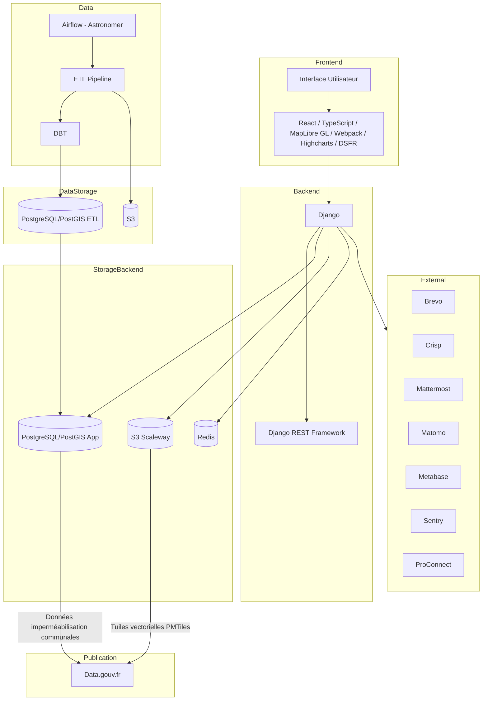
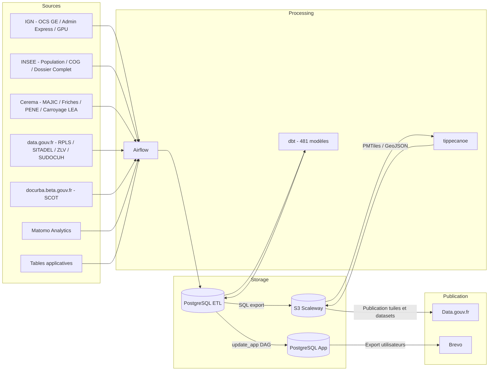
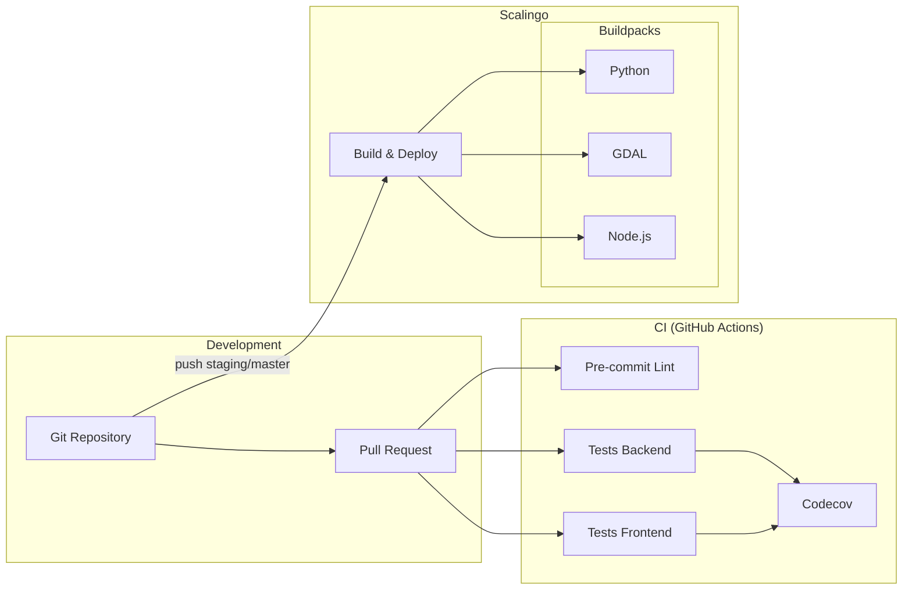

# Document d'architecture technique

## Architecture globale

### Vue d'ensemble

```mermaid
graph TB
    subgraph Frontend
        UI[Interface Utilisateur]
        LIBS[React / TypeScript / MapLibre GL / Webpack / Highcharts / DSFR]
    end

    subgraph Backend
        DJ[Django]
        DRF[Django REST Framework]
    end

    subgraph Data
        AF[Airflow - Astronomer]
        DBT[DBT]
        ETL[ETL Pipeline]
    end

    subgraph StorageBackend
        PG[(PostgreSQL/PostGIS App)]
        S3[(S3 Scaleway)]
        RD[(Redis)]
    end

    subgraph DataStorage
        PGD[(PostgreSQL/PostGIS ETL)]
        S3D[(S3)]
    end

    subgraph External
        SIB[Brevo]
        CR[Crisp]
        MT[Mattermost]
        MO[Matomo]
        MB[Metabase]
        SN[Sentry]
        PC[ProConnect]
    end

    subgraph Publication
        DG[Data.gouv.fr]
    end

    UI --> LIBS
    LIBS --> DJ
    DJ --> DRF
    DJ --> PG
    DJ --> S3
    DJ --> RD
    DJ --> External

    AF --> ETL
    ETL --> DBT
    DBT --> PGD
    ETL --> S3D
    PGD --> PG
    S3 --> |Tuiles vectorielles PMTiles| DG
    PG --> |Données imperméabilisation communales| DG
```

### Stack technique
- **Backend** : Django 3.2+ (Python 3.11), Django REST Framework, Gunicorn (9 workers)
- **Frontend** : React 18, TypeScript 5.6, DSFR (Design Système de l'État), Webpack 5
- **Base de données** : PostgreSQL 17 avec PostGIS 3.5
- **Cache** : Redis (cache des graphiques, sessions)
- **Stockage objet** : Scaleway S3 (région fr-par)
- **Data pipeline** : Apache Airflow (Astronomer Runtime 13.4.0), dbt
- **Conteneurisation** : Docker / Docker Compose
- **CI/CD** : GitHub Actions, déploiement sur Scalingo
- **Gestion des dépendances** : Pipenv (Python), npm (JavaScript)

### Services externes
- **Brevo** : envoi d'emails transactionnels (SMTP) et gestion de contacts (API)
- **Crisp** : chat support avec webhooks bidirectionnels
- **Mattermost** : notifications internes (déploiements, alertes, connexions admin)
- **Matomo** : analytique web (optionnel, stats.beta.gouv.fr)
- **Metabase** : tableaux de bord statistiques (hébergé sur Scalingo)
- **Highcharts** : génération de graphiques (serveur d'export dédié)
- **Sentry** : monitoring des erreurs (sentry.incubateur.net)
- **ProConnect** : authentification OpenID Connect (État français)
- **data.gouv.fr** : publication de données ouvertes via API

## Architecture Backend

### Structure du projet Django

Le projet est organisé en applications Django :

| Application | Rôle |
|---|---|
| `project/` | Application principale : diagnostics, 60+ graphiques Highcharts, API REST, exports PDF |
| `public_data/` | Modèles géospatiaux (artificialisation, consommation, démographie, imperméabilisation, friches) |
| `users/` | Utilisateurs (modèle custom basé sur email), profils, inscription/connexion |
| `home/` | Pages statiques, contact, newsletter, NPS, robots.txt, health check |
| `carto/` | Cartographie (réservé pour extensions futures) |
| `crisp/` | Webhooks Crisp, forwarding vers Mattermost, envoi de feedback |
| `oidc/` | Authentification ProConnect via OpenID Connect |
| `highcharts/` | Classe de base pour les graphiques Highcharts, export images/PDF |
| `utils/` | Utilitaires partagés : emails, Mattermost, anti-spam, couleurs, Excel, cache |
| `brevo/` | Intégration Brevo (migrations) |

### Modèles de données principaux

**`project/`** :
- `Project` : diagnostic territorial (utilisateur, période d'analyse 2009-2023, niveau territorial, objectif 2031)
- `Emprise` : contours géographiques des territoires
- `ExportJob` : suivi des exports PDF (statut, job_id)
- `ReportDraft` : brouillons de rapports éditables
- `UserLandPreference` : territoires favoris par utilisateur
- `Request` / `ErrorTracking` : suivi des requêtes et erreurs

**`public_data/`** :
- Modèles d'artificialisation : `LandArtifStock`, `LandArtifFlux`, `ArtifZonage` + compositions par couverture/usage
- Modèles d'imperméabilisation : `LandImperStock`, `LandImperFlux`, `ImperZonage` + compositions
- Modèles de consommation : `LandConso`, `LandConsoComparison`, `LandConsoStats`, `LandCarroyageBounds`
- Modèles démographiques : `LandPop`, `LandPopStats`, `LandPopulationDensity`, `LandSocioEconomicStats`
- Dossier complet (9 modèles) : activité/chômage, CSP, entreprises, emplois, équipements, logement, ménages, population, revenus/pauvreté, tourisme
- `NearestTerritories` : territoires similaires pour comparaison
- `AdminRef`, `LandModel`, `LandGeoJSON`, `Nation` : référentiels administratifs

**`users/`** :
- `User` : modèle custom (email comme identifiant, organisme, service, fonction, ProConnect, SIRET)

**`home/`** :
- `SatisfactionFormEntry` (NPS), `ContactForm`, `Newsletter`, `PageFeedback`

### Graphiques (60+)

Le système de graphiques dans `project/charts/` couvre :
- **Consommation** : cartes, bulles, comparaisons annuelles, cartes bivariées
- **Artificialisation** : cartes, flux par couverture/usage, flux nets, synthèse
- **Imperméabilisation** : même structure que l'artificialisation
- **Démographie** : comparaison population/consommation
- **Dossier complet** : 30+ graphiques (emploi, logement, CSP, entreprises, équipements, tourisme, revenus)
- **Territorialisation** : cartes d'efforts, objectifs, projections

Chaque graphique a une variante Export pour la génération PDF.

### API REST

Points d'entrée dans `project/api_urls.py` et `project/api_views/` :
- `EmpriseViewSet` : GeoJSON des contours territoriaux
- `ExportStartView` / `ExportStatusView` : démarrage et suivi d'export PDF
- `ReportDraftViewSet` : CRUD brouillons de rapports
- `ToggleFavoriteAPIView` : gestion des favoris
- `UpdatePreferenceTarget2031APIView` : mise à jour objectifs 2031
- `UpdatePreferenceComparisonLandsAPIView` : territoires de comparaison
- Endpoint graphiques avec cache Redis 24h

### Middleware custom (`config/middlewares.py`)

1. `LogIncomingRequest` : log des requêtes avec timing
2. `MaintenanceModeMiddleware` : redirection vers page de maintenance
3. `ForceNonceCSPMiddleware` : injection de nonces CSP
4. `HtmxMiddleware` : détection des requêtes HTMX
5. `LandTypeSlugMiddleware` : conversion slugs land_type en codes

### URLs principales (`config/urls.py`)

| Chemin | Application |
|---|---|
| `/admin/` | Django admin |
| `/oidc/` | ProConnect/OIDC |
| `/` | Pages d'accueil (home) |
| `/users/` | Gestion utilisateurs |
| `/public/` | Données publiques |
| `/diagnostic/` | Application principale |
| `/api/` | API REST |
| `/carte/` | Cartographie |
| `/crisp/` | Webhooks Crisp |

## Architecture des données

### Vue d'ensemble des pipelines Airflow

**Infrastructure** : Apache Airflow sur Astronomer Runtime 13.4.0, avec `tippecanoe` (v2.75.1, compilé dans le Dockerfile) pour la génération de tuiles vectorielles.

**Architecture multi-bases** : Airflow se connecte à 5 bases PostgreSQL :
1. **DBT Database** : transformations et staging (ogr2ogr, psycopg2, SQLAlchemy)
2. **Dev Database** : copie app pour environnement local
3. **Staging Database** : pré-production
4. **Production Database** : données applicatives en production
5. **Matomo Database** : analytique web

**Pools** : `DBT_POOL` (concurrence dbt limitée), `OCSGE_STAGING_POOL` (ingestion OCS GE)

**Injection de dépendances** : pattern DI via `dependency_injector` dans `include/container.py`, avec conteneurs Infrastructure (connexions S3, BDD, SFTP) et Domain (handlers fichiers, notifications, exports).

### DAGs (36 total)

#### OCS GE — Occupation des Sols (10 DAGs)

| DAG | Schedule | Description |
|---|---|---|
| `ingest_ocsge` | `@once` | Pipeline principal : téléchargement 7z → chargement staging → tests dbt → transformation → notification Mattermost |
| `download_all_ocsge` | `@once` | Téléchargement parallèle (max 10) de tous les départements vers S3 |
| `identify_changed_ocsge_data` | `0 10 * * *` | Scraping page IGN, alertes Mattermost pour URLs manquantes/modifiées |
| `diff_ocsge_download_page_to_mattermost` | `0 10 * * *` | Détection des changements sur la page de téléchargement OCS GE |
| `create_all_vector_tiles_france` | `@once` | Orchestrateur : déclenche la génération de 7 types de tuiles pour tous les départements |
| `create_ocsge_vector_tiles` | `@once` | PMTiles occupation_du_sol (SQL → GeoJSON → tippecanoe → S3) |
| `create_ocsge_artif_diff_vector_tiles` | `@once` | PMTiles différences d'artificialisation (ZAN) |
| `create_ocsge_diff_vector_tiles` | `@once` | PMTiles différences d'imperméabilisation |
| `create_ocsge_friche_vector_tiles` | `@once` | PMTiles friches |
| `create_zonage_urbanisme_vector_tiles` | `@once` | PMTiles zonage d'urbanisme (GPU) |

+ 2 DAGs pour les GeoJSON centroïdes (artificialisation et imperméabilisation)

#### Données administratives et territoriales (4 DAGs)

| DAG | Schedule | Description |
|---|---|---|
| `ingest_admin_express` | `@once` | Limites Admin Express IGN (7z → shapefiles → ogr2ogr) |
| `ingest_gpu` | `@once` | Zonage d'urbanisme IGN via SFTP |
| `ingest_plan_communal` (sudocuh) | `@once` | Données SUDOCUH depuis data.gouv.fr |
| `ingest_scots` | `@once` | SCOT depuis l'API docurba.beta.gouv.fr |

#### Données INSEE (3 DAGs)

| DAG | Schedule | Description |
|---|---|---|
| `ingest_population` | `@once` | Population historique 1876-2022 (Excel INSEE) |
| `ingest_cog_changes` | `@once` | Changements COG 2025 (limites administratives) |
| `ingest_dossier_complet` | `@once` | Recensement INSEE (1900+ colonnes dépivotées en EAV) |

#### Données foncières et environnementales (5 DAGs)

| DAG | Schedule | Description |
|---|---|---|
| `ingest_majic` | `@once` | Données foncières MAJIC (Cerema, shapefiles) |
| `ingest_carroyage_lea` | `@once` | Carroyage LEA consommation d'espace (data.gouv.fr → ogr2ogr → dbt → PMTiles) |
| `ingest_cartofriches` | `@once` | Inventaire des friches Cerema (GeoPackage) |
| `ingest_pene` | `@once` | Zones PENE Cerema (WFS) |
| `ingest_zlv` | `@once` | Consommation d'espaces par zonage (3 niveaux : commune, département, région) |

#### Données logement (2 DAGs)

| DAG | Schedule | Description |
|---|---|---|
| `ingest_sitadel` | `@once` | Permis de construire (3 jeux : communes, départements, EPCI) |
| `ingest_rpls` | `@once` | Logements sociaux RPLS (3 niveaux) |

#### Application et exports (5 DAGs)

| DAG | Schedule | Description |
|---|---|---|
| `update_app` | `@once` | Copie données transformées de la BDD dbt vers les BDD app (dev/staging/prod) |
| `deploy_static_files` | `@once` | Déploiement PMTiles et GeoJSON vers le bucket S3 de production |
| `export_all_to_data_gouv` | `@once` | Publication de datasets sur data.gouv.fr (CSV, GeoPackage) |
| `archive_all_from_data_gouv` | `@once` | Suppression de datasets sur data.gouv.fr |
| `update_brevo` | `@daily` | Export CSV utilisateurs → S3 → import Brevo |

#### Maintenance (3 DAGs)

| DAG | Schedule | Description |
|---|---|---|
| `ingest_app_tables` | `@daily` | Copie 5 tables app vers BDD dbt (users, requests, projects, newsletter, satisfaction) |
| `ingest_matomo_tables` | `0 4 * * *` | Ingestion données analytique Matomo |
| `backup_dbt_staging_db` | `0 1 * * 0` | Backup hebdomadaire pg_dump → S3 |

#### Utilitaires (1 DAG)

| DAG | Schedule | Description |
|---|---|---|
| `dbt_build` | Manuel | Exécution de commandes dbt arbitraires |

### Handlers personnalisés (`airflow/include/`)

24 classes de handlers réparties en catégories :
- **Fichiers** : `HTTPFileHandler`, `RemoteToS3FileHandler`, `RemoteZipToS3FileHandler`
- **CSV/XLSX** : `CSVFileIngestor`, `XLSXFileIngestor`, `S3CSVFileToDBTableHandler`, `S3XLSXFileToDBTableHandler`
- **Géospatial** : `S3GeoJsonFileToDBTableHandler`, `GeoJsonToGzippedGeoJsonOnS3Handler`
- **Export** : `SQLToCSVOnS3Handler`, `SQLToGeoJsonOnS3Handler`, `SQLToGeopackageOnS3Handler`, `SQLToGeojsonSeqOnS3Handler`
- **S3** : `S3Handler` (opérations génériques)
- **data.gouv.fr** : `DataGouvHandler`, `S3ToDataGouvHandler`
- **Notifications** : `MattermostNotificationService`

### Flux de données

```mermaid
flowchart LR
    subgraph Sources
        IGN[IGN - OCS GE / Admin Express / GPU]
        INSEE[INSEE - Population / COG / Dossier Complet]
        CEREMA[Cerema - MAJIC / Friches / PENE / Carroyage LEA]
        OPENDATA[data.gouv.fr - RPLS / SITADEL / ZLV / SUDOCUH]
        DOCURBA[docurba.beta.gouv.fr - SCOT]
        MATOMO_SRC[Matomo Analytics]
        APP_SRC[Tables applicatives]
    end

    subgraph Processing
        AF[Airflow]
        DBT[dbt - 481 modèles]
        TIPPECANOE[tippecanoe]
    end

    subgraph Storage
        PG[(PostgreSQL ETL)]
        S3[(S3 Scaleway)]
        APP_DB[(PostgreSQL App)]
    end

    subgraph Publication
        DG[Data.gouv.fr]
        BREVO[Brevo]
    end

    IGN --> AF
    INSEE --> AF
    CEREMA --> AF
    OPENDATA --> AF
    DOCURBA --> AF
    MATOMO_SRC --> AF
    APP_SRC --> AF

    AF --> PG
    PG --> DBT
    DBT --> PG
    PG --> |update_app DAG| APP_DB
    PG --> |SQL export| S3
    S3 --> TIPPECANOE
    TIPPECANOE --> |PMTiles / GeoJSON| S3
    S3 --> |Publication tuiles et datasets| DG
    APP_DB --> |Export utilisateurs| BREVO
```

### Projet dbt

**Localisation** : `airflow/include/sql/sparte/`

**Statistiques** : 481 modèles SQL, 70 macros, 33 tests custom, 4 seeds, 218 fichiers YAML de documentation.

#### Organisation des modèles (18 schémas)

| Schéma | Nb modèles | Contenu |
|---|---|---|
| `ocsge` | 167 | Occupation du sol, artificialisation, flux et stocks par niveau administratif |
| `for_app` | 62 | Données prêtes pour l'application (artificialisation, imperméabilisation, consommation, friches, démographie, bivarié, dossier complet) |
| `insee` | 52 | Données démographiques, dossier complet (18 tables), flux/stock population |
| `for_export` | 34 | Datasets pour publication (CSV, GeoPackage) |
| `admin_express` | 30 | Communes, départements, régions, EPCI, outre-mer |
| `majic` | 33 | Données foncières MAJIC |
| `cartofriches` | 12 | Inventaire des friches |
| `land` | 11 | Entités territoriales |
| `gpu` | 11 | Zonage d'urbanisme |
| `sitadel` | 10 | Autorisations de logements |
| `zlv` | 10 | Logements vacants |
| `rpls` | 12 | Logements sociaux |
| `matomo` | 8 | Analytique web |
| `for_vector_tiles` | 8 | Données pour génération de tuiles |
| `sudocuh` | 6 | Données habitat |
| `analytics` | 5 | Vues analytiques |
| `app` | 5 | Données applicatives |
| `docurba` | 3 | SCOT |
| `for_brevo` | 1 | Export marketing |
| `misc` | 1 | Divers |

#### Architecture en couches

1. **Base** : mapping direct des sources
2. **Staging** (`1_staging/`) : transformations initiales
3. **Transformation** (`2_transformation/`) : calculs complexes (flux, stocks, intersections géographiques)
4. **Mart** (`3_mart/`) : données prêtes pour consommation (app, export, tuiles vectorielles)

#### Logique métier clé

- **Classification OCS GE** : couverture du sol (CS) + utilisation du sol (US) → artificialisation et imperméabilisation via macros `is_artificial()` et `is_impermeable()`
- **Calculs de flux** : changements annuels d'occupation à tous les niveaux administratifs (commune, EPCI, SCOT, département, région, nation, territoire personnalisé)
- **Calculs de stock** : état courant agrégé par couverture, usage et zonage
- **Systèmes de coordonnées** : 2154 (Lambert 93 métropole), 32620/2972/2975/4471 (outre-mer)

#### Seeds

- `couverture.csv` : classification de la couverture du sol
- `usage.csv` : classification de l'usage du sol
- `seed_custom_land.csv` / `seed_custom_land_commune.csv` : territoires personnalisés

## Architecture Frontend

### Organisation

```
frontend/
├── scripts/                    # Code applicatif React/TypeScript (350+ fichiers)
│   ├── index.js               # Point d'entrée
│   ├── react-roots.tsx        # Points de montage React dans le DOM Django
│   ├── components/
│   │   ├── ui/                # 30 composants UI réutilisables
│   │   ├── layout/            # Dashboard, Navbar, Header, Footer, TopBar
│   │   ├── features/          # Composants fonctionnels (status, ocsge, friches)
│   │   ├── charts/            # 13+ composants graphiques
│   │   ├── map/               # 134+ composants cartographiques
│   │   └── pages/             # 10 pages principales
│   ├── hooks/                 # 16 hooks custom
│   ├── services/              # API (RTK Query, 40+ endpoints)
│   ├── store/                 # Redux store et slices
│   ├── theme/                 # Thème (couleurs, typographie, spacing)
│   ├── types/                 # Définitions TypeScript
│   └── utils/                 # Utilitaires (URLs, formatage, CSRF)
├── styles/                    # CSS global (DSFR + MapLibre)
├── assets/                    # Fichiers statiques
└── images/                    # Images
```

### Points de montage React

L'application React se monte dans des templates Django via des `div` dédiés :
- `#react-root` : dashboard principal (SPA avec React Router)
- `#react-search-bar` : barre de recherche de territoires
- `#react-highcharts-ocsge` : carte Highcharts de couverture OCS GE
- `#react-footer-consent` : gestion du consentement cookies
- `#cookie-consent-root` : bannière cookies
- `#toast-root` : notifications toast
- `#react-rapport-draft` : rendu PDF des rapports

### Pages principales

| Page | Route | Fonctionnalités |
|---|---|---|
| Synthèse | `/diagnostic/{type}/{slug}/synthese` | Dashboard KPIs, vue d'ensemble |
| Consommation | `.../consommation` | Statistiques NAF, tendances annuelles, comparaisons, démographie, carroyage, cartes bivariées |
| Artificialisation | `.../artificialisation` | Taux, flux nets, répartition par couverture/usage, zonage, territoires enfants |
| Imperméabilisation | `.../impermeabilisation` | Même structure que l'artificialisation |
| Friches | `.../friches` | Inventaire, statuts, couverture OCS GE |
| Logements vacants | `.../vacance-des-logements` | Statistiques, autorisations, comparaisons |
| Résidences secondaires | `.../residences-secondaires` | Analyse (réservé membres DGALN) |
| Trajectoires | `.../trajectoires` | Objectifs 2031, chemins de sobriété |
| Rapport local | `.../rapport-local` | Génération de rapports triennaux |
| Téléchargements | `.../telechargements` | Gestion des brouillons, export PDF, éditeur TipTap |

### Système cartographique (134+ composants)

Architecture sophistiquée avec :
- **10 types de cartes spécialisées** : friches, artificialisation, imperméabilisation, OCS GE, zonage d'urbanisme, carroyage LEA
- **40+ définitions de couches** (raster, vecteur, PMTiles, GeoJSON, clusters)
- **16 sources de données** (VectorTiles, PMTiles, GeoJSON, raster, OSM)
- **Système de contrôles** : opacité, visibilité, sélection de millésimes, filtres de nomenclature
- **Panneaux d'information** : affichage contextuel au clic, pie charts, statistiques
- **Panneaux latéraux** : détails des entités, diagrammes
- **Factory** : `initMapFromConfig` pour instanciation déclarative des cartes

### Gestion d'état

**Redux Toolkit** avec RTK Query :
- `djangoApi` : 40+ endpoints RTK Query avec cache 600s et invalidation par tags
- `navbarSlice` : état du menu responsive
- `pdfExportSlice` : suivi des jobs d'export PDF
- Middleware custom : gestion des erreurs d'authentification

### Hooks custom (16)

`useArtificialisation`, `useImpermeabilisation`, `useFriches`, `useMillesime`, `useNearestTerritories`, `useComparisonTerritories`, `useReportDrafts`, `useConsentManagement`, `useAuthGuard`, `useDataTable`, `useDebounce`, `usePageTitle`, `useMatomoTracking`, `useWindowSize`, `useConsoData`, `useMap`

### Build (Webpack 5)

- **Développement** : dev server port 3000, HMR, source maps, Bundle Analyzer port 8989
- **Production** : minification Terser, hashing des assets, `webpack-bundle-tracker` pour intégration Django
- **Transpilation** : Babel (preset-env, preset-react, preset-typescript)
- **Path aliases** : `@components/*`, `@hooks/*`, `@store/*`, `@services/*`, `@utils/*`, `@theme/*`

### Technologies frontend

| Catégorie | Technologie |
|---|---|
| Framework | React 18.2 |
| Langage | TypeScript 5.6 |
| État | Redux Toolkit 2.2 + RTK Query |
| Routage | React Router 6.26 |
| Design System | DSFR 1.8.5 + react-dsfr 1.16 |
| CSS | Styled-components 6.1 + Bootstrap 5.3 |
| Cartographie | MapLibre GL 5.0 + PMTiles 4.2 + Turf.js 7.2 |
| Graphiques | Highcharts 11.4 |
| Éditeur riche | TipTap 2.10 |
| Icônes | Bootstrap Icons + RemixIcon |
| Animations | Lottie React |
| Bundler | Webpack 5.96 |

## Infrastructure

### Environnements
1. **Local (Docker Compose)**
   - `db` : PostgreSQL 17 / PostGIS 3.5 (port 5555)
   - `redis` : Redis Alpine (port 6379)
   - `s3` : VersityGW S3-compatible (port 7070)
   - `frontend` : Webpack dev server (port 3002)
   - `django` : serveur de développement (port 8080)
   - `export-server` : service d'export Node.js/Puppeteer (port 3000)

2. **Production (Scalingo)**
   - Déploiement automatisé via push sur `staging`/`master`
   - Base de données PostgreSQL managée
   - Redis managé
   - Stockage S3 sur Scaleway (région fr-par)
   - Gunicorn avec 9 workers, timeout 180s

3. **Airflow (serveur dédié)**
   - Astronomer Runtime 13.4.0 (Docker)
   - Connexions à 5 bases PostgreSQL
   - Stockage S3 Scaleway
   - SFTP vers IGN pour les données GPU

### Démarrage de l'application

**Procfile** (Scalingo) :
- `web` : `gunicorn` via `bin/start.sh` (9 workers, 180s timeout)
- `postdeploy` : `bin/post_deploy_hook.sh` (migrations, clear cache, notification Mattermost)

### Commandes Make

| Commande | Description |
|---|---|
| `make install` | Installation complète |
| `make start` / `stop` / `restart` | Gestion des services Docker |
| `make migrate` / `makemigrations` | Migrations Django |
| `make test` | Tous les tests |
| `make test-backend` / `test-frontend` / `test-airflow` | Tests ciblés |
| `make logs` / `logs-django` / `logs-db` | Consultation des logs |
| `make restore-db` | Restauration de backup |

### Configuration
- Variables d'environnement pour tous les paramètres sensibles (voir `ENV.md`)
- Configurations par environnement : local, staging, production
- `.env` et `airflow/.env` pour les secrets

## Monitoring et Logging
- **Sentry** (sentry.incubateur.net) : monitoring des erreurs en production avec intégration Django et Redis
- **Logs applicatifs** : niveaux configurables via `LOGGING_LEVEL`, log de chaque requête entrante avec timing
- **Mattermost** : alertes de déploiement, connexions admin, erreurs critiques, changements de données OCS GE
- **Matomo** : analytique web (optionnel, stats.beta.gouv.fr)
- **Metabase** : tableaux de bord statistiques et KPIs

## Sécurité

### Authentification et Autorisation
1. **Gestion des utilisateurs**
   - Modèle utilisateur personnalisé basé sur l'email (pas de username)
   - Champs profil : organisme, service, fonction, SIRET
   - Authentification via ProConnect (OpenID Connect)
   - Authentification locale avec validation forte des mots de passe
   - Double authentification (2FA) avec TOTP (django-otp, django-two-factor-auth)
   - Sessions utilisateur en base de données
   - Middleware de complétion de profil (redirection si profil incomplet)

2. **Contrôle d'accès**
   - Middleware d'authentification Django
   - Permissions granulaires basées sur les rôles (DGALN, etc.)
   - Protection des vues par LoginRequiredMixin
   - Validation des tokens pour les webhooks Crisp
   - Accès conditionnel aux pages (résidences secondaires réservé DGALN)

### Protection des données
1. **Sécurité des communications**
   - HTTPS obligatoire en production
   - Validation des origines CORS stricte
   - Protection contre le clickjacking (X-Frame-Options SAMEORIGIN)
   - Referrer Policy : strict-origin-when-cross-origin

2. **Politique de sécurité du contenu (CSP)**
   - Configuration stricte des sources autorisées via middleware custom
   - Nonces pour les scripts inline
   - Sources configurées pour : scripts, styles, images, frames, connexions
   - Autorisations spécifiques : Metabase, Matomo, Crisp, MapLibre tiles

3. **Protection CSRF**
   - Middleware CSRF activé
   - Tokens CSRF intégrés dans les appels RTK Query (cookie-based)
   - Protection des API REST

4. **Stockage sécurisé**
   - Chiffrement des mots de passe
   - Gestion sécurisée des secrets d'API via variables d'environnement
   - Stockage S3 avec contrôle d'accès

### Audit et Monitoring
- Logs détaillés des requêtes avec timing (`LogIncomingRequest`)
- Historisation des modifications avec django-simple-history
- Monitoring des erreurs avec Sentry
- Notifications Mattermost pour connexions admin et événements critiques
- Feedback utilisateur : NPS, formulaire de contact, feedback par page

## Processus de développement

### Tests
- **Backend** : Django test (`python manage.py test`)
- **Frontend** : Jest + Testing Library (`npm test`)
- **Airflow** : tests dédiés (`make test-airflow`)
- **dbt** : 33 tests custom (géométrie, qualité, logique métier)

### Qualité de code
- Pre-commit hooks : ggshield (secrets), sqlfluff (SQL), flake8, ESLint
- Bandit pour l'analyse de sécurité Python
- TypeScript strict (noImplicitAny, strictNullChecks)

### Intégration continue (GitHub Actions)

| Workflow | Déclencheur | Actions |
|---|---|---|
| `pr.yml` | Push sur branches (sauf staging/master) | Pre-commit lint, tests backend (PostGIS), tests frontend (Jest + Codecov) |
| `deploy_airflow.yml` | Push sur staging | Git pull sur serveur Airflow via SSH |
| `airflow_test.yml` | - | Tests Airflow |


```mermaid
flowchart LR
    subgraph Development
        GIT[Git Repository]
        PR[Pull Request]
    end

    subgraph CI["CI (GitHub Actions)"]
        LINT[Pre-commit Lint]
        TEST_BE[Tests Backend]
        TEST_FE[Tests Frontend]
        COV[Codecov]
    end

    subgraph Scalingo
        subgraph Buildpacks
            BP_PYTHON[Python]
            BP_GDAL[GDAL]
            BP_NODE[Node.js]
        end
        BUILD[Build & Deploy]
    end

    GIT --> PR
    PR --> LINT
    PR --> TEST_BE
    PR --> TEST_FE
    TEST_BE --> COV
    TEST_FE --> COV

    GIT --> |push staging/master| BUILD
    BUILD --> BP_PYTHON & BP_GDAL & BP_NODE
```

## Dépendances principales

### Python
- Django, Django REST Framework, django-simple-history, django-import-export, django-filter
- GeoDjango (PostGIS)
- mozilla-django-oidc (ProConnect)
- django-two-factor-auth, django-otp
- django-redis, fancy-cache
- django-csp, django-cors-headers
- django-crispy-forms + crispy-bootstrap5
- django-webpack-loader (intégration Webpack)
- sentry-sdk

### JavaScript/TypeScript
- React 18, React DOM, React Router 6, React Redux
- Redux Toolkit (RTK Query)
- MapLibre GL 5, PMTiles, Turf.js
- Highcharts + highcharts-react-official
- TipTap (éditeur riche)
- DSFR + react-dsfr
- Styled-components, Bootstrap 5
- Webpack 5, Babel, TypeScript 5.6

### Data Pipeline
- Apache Airflow (Astronomer)
- dbt (dbt-postgres)
- tippecanoe (génération PMTiles)
- ogr2ogr / GDAL (chargement géospatial)
- geopandas, psycopg2, SQLAlchemy
- dependency-injector (DI)
